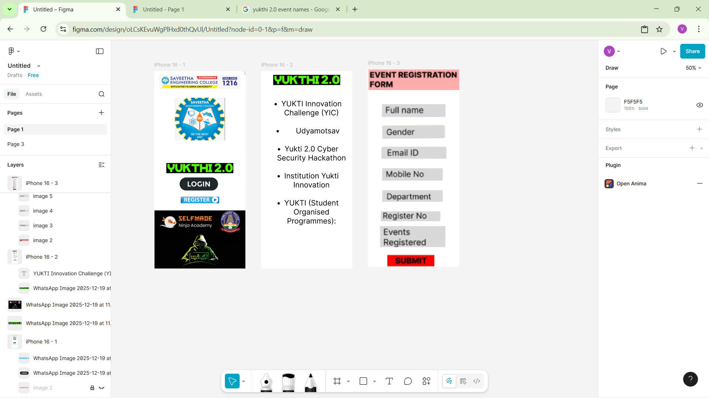

# Ex08 Event Registration Web Application
## Date:29/12/2025

## AIM:
To design, develop and deploy a web application for event registration using Figma UI tool.

## UI DESIGN TOOL:
Figma

## DESIGN STEPS:

### Step 1:
Use frames to represent screens or sections.

### Step 2:
Add column grids for consistent spacing and alignment.

### Step 3:
Insert shapes, text, buttons, and icons.

### Step 4:
Use Auto Layout for flexible, responsive design.

### Step 5:
Define color, text, and effect styles globally for consistency.

### Step 6:
Name layers logically and group related elements.

### Step 6:
Link frames to show navigation or interactions.

### Step 7:
Select the specific frame while generating code using Anima plugin.

## CODE:
```
<div style="width: 393px; height: 852px; position: relative; background: white; overflow: hidden">
  <div style="width: 9px; height: 29px; left: 388px; top: -14px; position: absolute; background: #D9D9D9"></div>
  
  <div style="width: 6px; height: 7px; left: 387px; top: 845px; position: absolute; background: #D9D9D9"></div>
  
  
  
</div>


<div style="width: 393px; height: 852px; position: relative; background: white; overflow: hidden">
  
  <div style="width: 386px; height: 507px; left: 0px; top: 120px; position: absolute; text-align: center"><span style="color: black; font-size: 32px; font-family: Inter; font-weight: 400; word-wrap: break-word">YUKTI Innovation Challenge (YIC)<br/></span><span style="color: black; font-size: 32px; font-family: Inter; font-weight: 400; word-wrap: break-word"><br/></span><span style="color: black; font-size: 32px; font-family: Inter; font-weight: 400; word-wrap: break-word">      Udyamotsav<br/></span><span style="color: black; font-size: 32px; font-family: Inter; font-weight: 400; word-wrap: break-word"><br/></span><span style="color: black; font-size: 32px; font-family: Inter; font-weight: 400; word-wrap: break-word">Yukti 2.0 Cyber Security Hackathon<br/></span><span style="color: black; font-size: 32px; font-family: Inter; font-weight: 400; word-wrap: break-word"><br/></span><span style="color: black; font-size: 32px; font-family: Inter; font-weight: 400; word-wrap: break-word">Institution Yukti Innovation<br/></span><span style="color: black; font-size: 32px; font-family: Inter; font-weight: 400; word-wrap: break-word"><br/></span><span style="color: black; font-size: 32px; font-family: Inter; font-weight: 400; word-wrap: break-word">YUKTI (Student Organised Programmes):</span></div>
</div>
<div style="width: 393px; height: 852px; position: relative; background: white; overflow: hidden">
  
  
  
  
  
  
  
  
  
</div>
```

## OUTPUT:



## RESULT:
The program to design, develop and deploy a web application for event registration using Figma UI tool is completed successfully.
